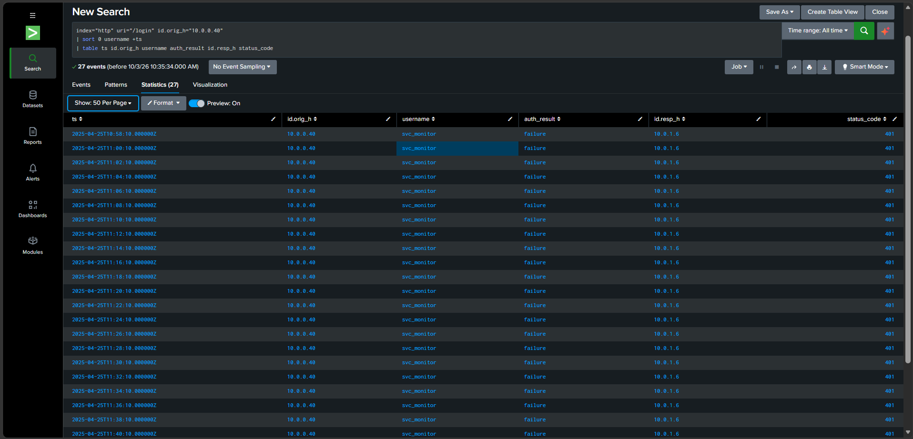
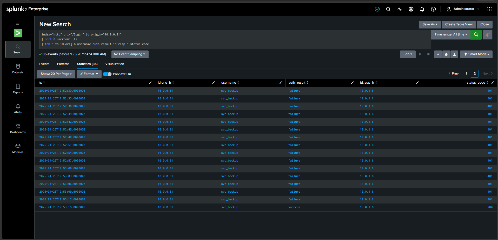
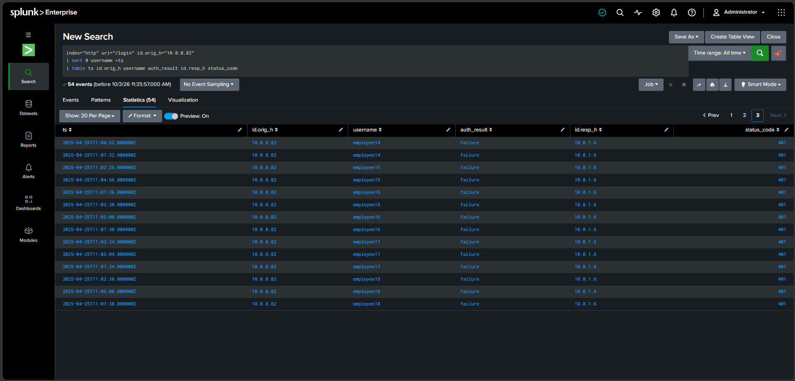
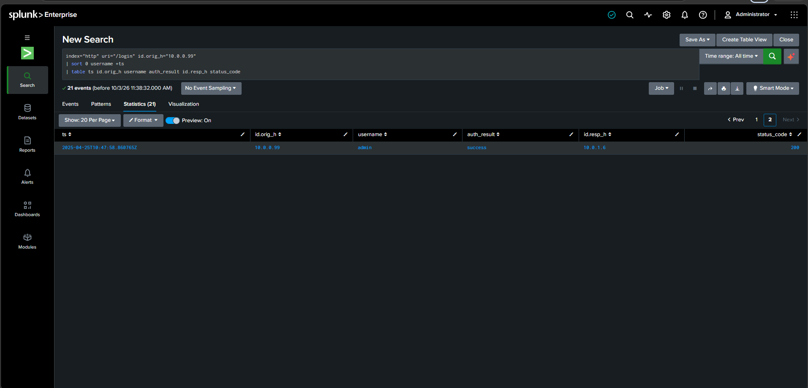

## Step 1: Upload the HTTP Log File

1. Open **Splunk** and upload the HTTP log file.
2. Set the time range to **All time**.
3. Verify that the total number of events is **4,000**.


## Step 2: Search for Multiple Failed Login Attempts

```spl
# Search the HTTP index for failed/authentication-related login requests
index="http" ("*fail*" OR "*auth*") uri="/login"

# Count matching login requests for each source IP
| stats count BY id.orig_h

# Display only IPs with 20 or more login requests
| where count >= 20
```


## Step 3: Individually Analyze Each IP for Successful Login Attempts

After identifying IP addresses with multiple login attempts, I investigated each IP individually to determine whether the login attempts were successful or unsuccessful.

### Splunk Query

```spl
# Search login events for a specific source IP 
index="http" uri="/login" id.orig_h="10.0.0.40"

# Sort events by username and timestamp
| sort 0 username +ts

# Display relevant fields for login analysis
| table ts id.orig_h username auth_result id.resp_h status_code
```

### 1. IP: 10.0.0.40
  The activity from ```10.0.0.40``` shows login attempts associated with the username ```sv_monitor```. The attempts appear to be unsuccessful.




### 2. IP: 10.0.0.50
The activity from ```10.0.0.50``` appears consistent with normal employee login activity.


### 3. IP: 10.0.0.81
The activity from ```10.0.0.81``` shows a successful login associated with the username ```sv_backup```.




### 4. IP: 10.0.0.82
   The activity from ```10.0.0.82``` shows multiple unsuccessful login attempts using different employee usernames.




### 4. IP: 10.0.0.99
   The activity from ```10.0.0.99``` shows a successful login associated with the username admin.


   
### Summary

I analyzed the five IP addresses individually to identify successful and failed login attempts. `10.0.0.40` (`sv_monitor`) and `10.0.0.82` showed failed login activity, while `10.0.0.81` (`sv_backup`) and `10.0.0.99` (`admin`) showed successful logins. `10.0.0.50` appeared consistent with normal employee activity.

I also investigated the identified IPs for any further related activity but did not find additional relevant events. Based on the available log data, I could not determine any further activity associated with these IPs.

### Next Step

Since no further related activity was identified, I escalated the findings to the **SOC L2 team** for further analysis and investigation.

