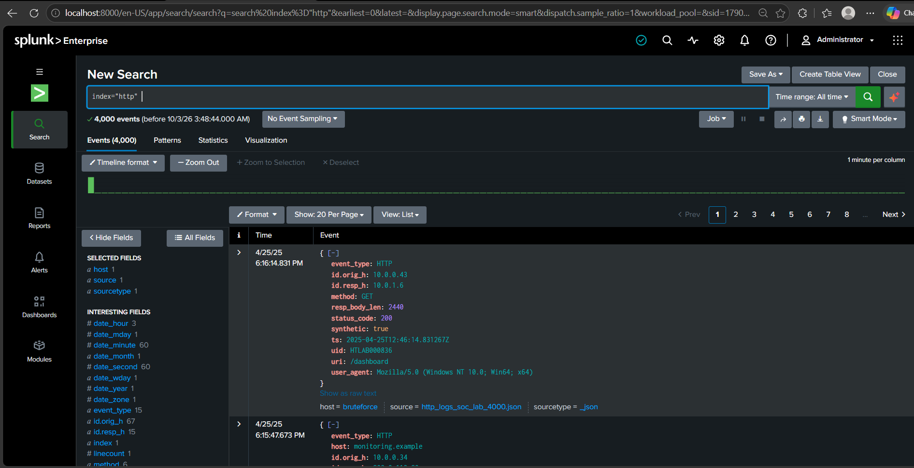
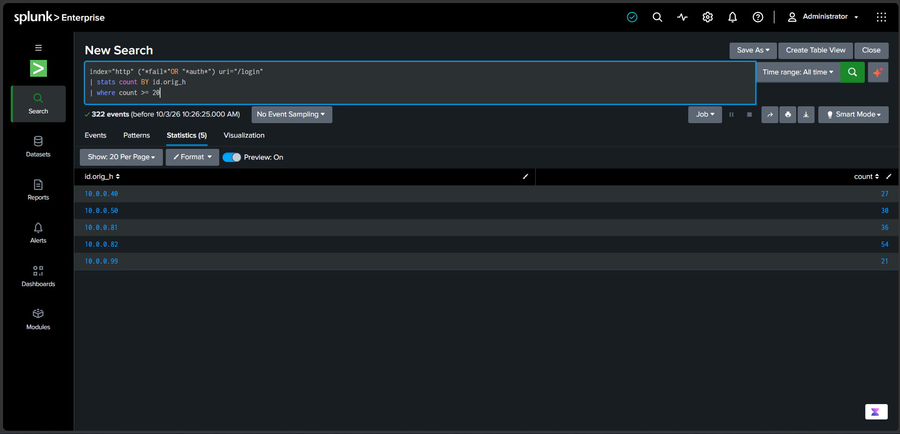

## Step 1: Upload the HTTP Log File

1. Open **Splunk** and upload the HTTP log file.
2. Set the time range to **All time**.
3. Verify that the total number of events is **4,000**.



## Step 2: Search for Multiple Failed Login Attempts

```spl
# Search the HTTP index for failed/authentication-related login requests
index="http" ("*fail*" OR "*auth*") uri="/login"

# Count matching login requests for each source IP
| stats count BY id.orig_h

# Display only IPs with 20 or more login requests
| where count >= 20
```



