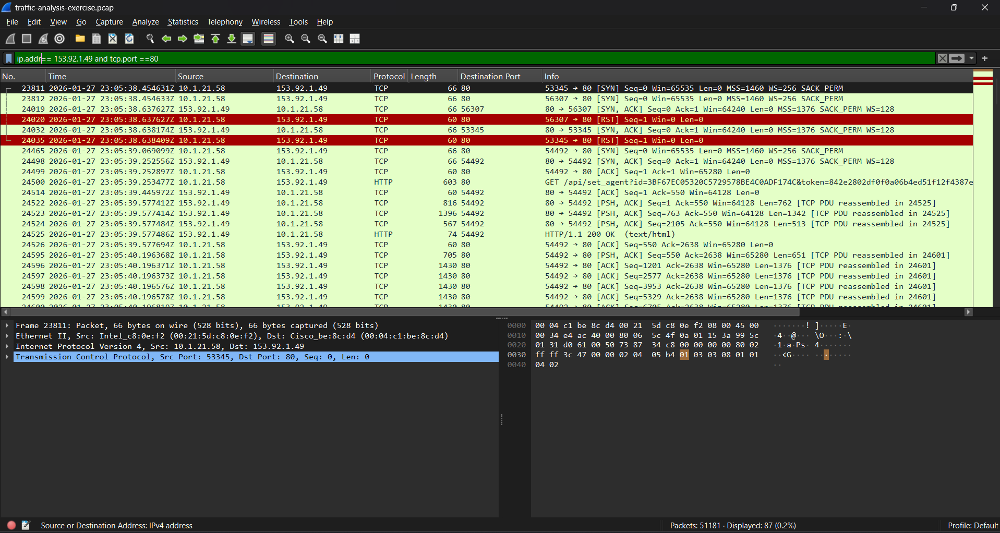
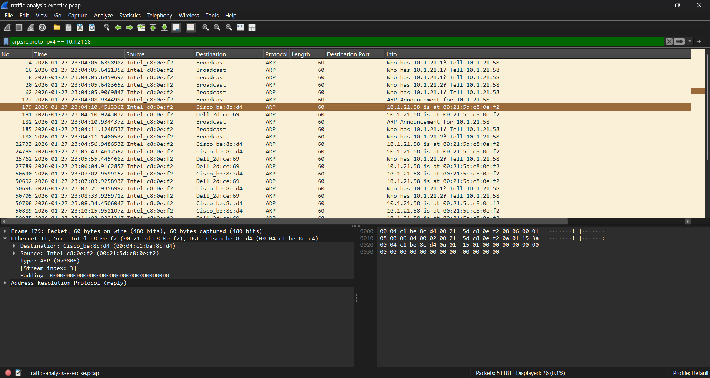
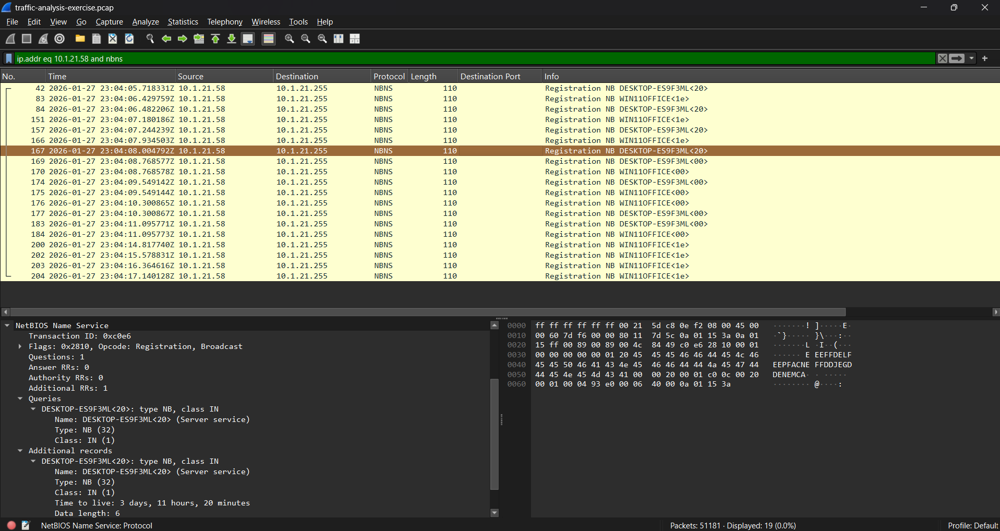
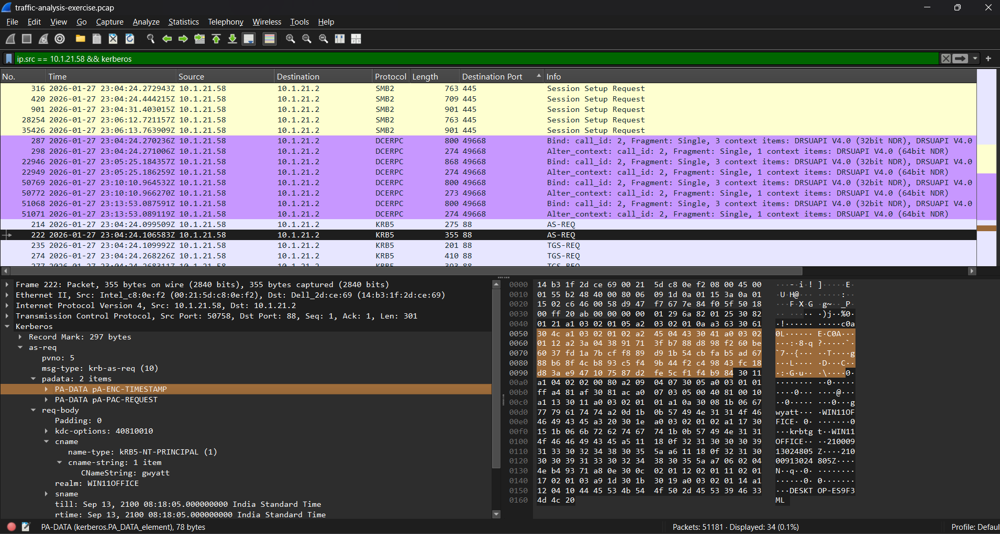
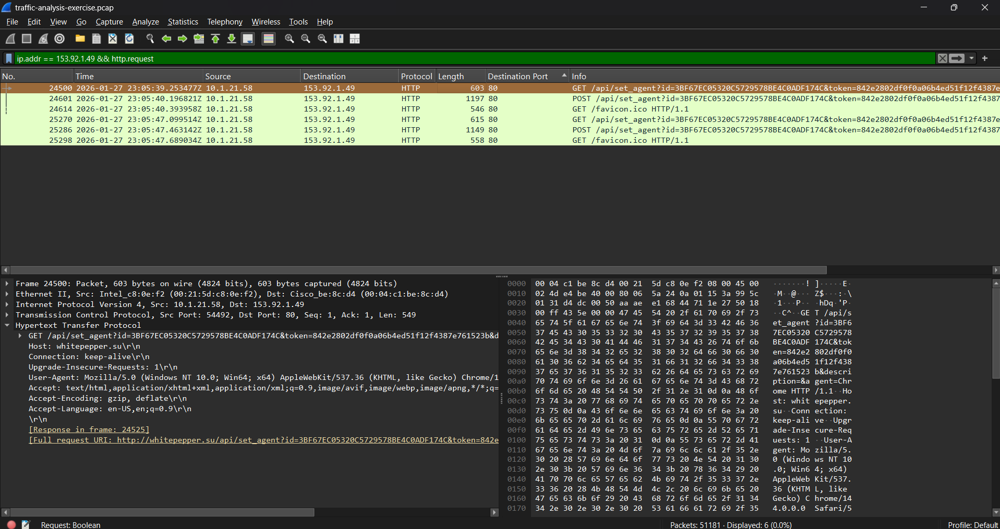

# Network Traffic Analysis — Wireshark PCAP Investigation

## Overview

This project uses Wireshark to investigate a packet capture associated with an **ET MALWARE Lumma Stealer Victim Fingerprinting Activity** alert.

The objective is to identify the Windows client and associated user, then document packet evidence so incident responders can locate the computer and account.

## Environment

| Component | Value |
|---|---|
| LAN subnet | `10.1.21.0/24` |
| Domain | `win11office[.]com` |
| AD environment name | `WIN11OFFICE` |
| Domain controller IP | `10.1.21.2` |
| Domain controller hostname | `WIN-LU4L24X3UB7` |
| LAN gateway | `10.1.21.1` |
| Broadcast address | `10.1.21.255` |

## Background

During a review of the previous week's alerts, a SOC analyst identifies a signature hit for **ET MALWARE Lumma Stealer Victim Fingerprinting Activity**.

The alert relates to traffic from `153.92.1.49` over **TCP port 80**, occurring on **27 January 2026 at 23:05 UTC**.

A packet capture of the associated internal client's traffic is provided for investigation.

## Investigation Questions

1. What is the IP address of the infected Windows client?
2. What is the MAC address of the client?
3. What is the client's hostname?
4. What is the associated user account name?
5. What is the user's full name?
6. Which domain associated with `153.92.1.49` triggered the alert?

## Tools and Evidence

- **Wireshark:** Packet filtering, protocol inspection, and stream analysis.
- **PCAP:** `traffic-analysis-exercise.pcap`
- **Screenshots:** Relevant packet fields supporting each finding.

## Investigation Method and Findings

### 1. What is the IP address of the infected Windows client?

I filtered traffic involving the alerted external IP over TCP port 80.

```wireshark
ip.addr == 153.92.1.49 and tcp.port == 80
```

I reviewed the source and destination addresses around the supplied alert time: **27 January 2026 at 23:05 UTC**.

**Finding:** The internal client communicating with the alerted server was `10.1.21.58`.




### 2. What is the MAC address of the client?

I selected an outbound packet from `10.1.21.58` and inspected the Source address under **Ethernet II**.

```wireshark
ip.src == 10.1.21.58 && ip.dst == 153.92.1.49 && tcp.port == 80
```

The source MAC address was `00:21:5d:c8:0e:f2`.

I then used ARP traffic to confirm the association:

```wireshark
arp.src.proto_ipv4 == 10.1.21.58
```

The ARP response showed:

`10.1.21.58 is at 00:21:5d:c8:0e:f2`

**Answer:** The client MAC address is **`00:21:5d:c8:0e:f2`**.




### 3. What is the client's hostname?

I filtered NetBIOS Name Service traffic sent by the client:

```wireshark
ip.addr eq 10.1.21.58 and nbns
```

I inspected the name-registration packets and expanded **NetBIOS Name Service** then again expend **Query** section and see the computer name registered by the client.

**Answer:** The client hostname is **`DESKTOP-ES9F3ML`**.




### 4. What is the associated user account name?

I filtered Kerberos traffic sent by the client:

```wireshark
ip.src == 10.1.21.58 && kerberos
```

I selected an authentication request and expanded **Kerberos → as-req → req-body → cname → CNameString** to inspect the account name.

**Answer:** The user account name is **`gwyatt`**.



### 5. What is the user's full name?

- gWyatt looks like it could represent a first name and last name, so I searched the packet details for Wyatt.

### Wireshark Search

  1. Clear the filter
  2. Press Ctrl + F.
  3. Select Packet details → String and Enable Case sensitive by ticking the checkbox.
  4. Search for Wyatt.
  5. Check the Full Name field associated with the result.

[Watch the Full User name find screen recording](Images/full-name.mp4)


  
### 6. Which domain associated with `153.92.1.49` triggered the alert?

I filtered HTTP requests to the alerted server:

```wireshark
ip.addr == 153.92.1.49 && http.request
```

I selected a request from `10.1.21.58`, expanded **Hypertext Transfer Protocol**, and inspected the **Host** field.

**Answer:** The domain associated with the alerted traffic is **`whitepepper[.]su`**.




## Findings Summary

| Item | Finding |
|---|---|
| Client IP | `10.1.21.58` |
| Client MAC | `00:21:5d:c8:0e:f2` |
| Client hostname | `DESKTOP-ES9F3ML` |
| User account | `gwyatt` |
| User’s full name | Gabriel Wyatt |
| Alert-associated domain | `whitepepper.su` |
| External server | `153.92.1.49:80` |

## Conclusion

I traced the supplied Lumma Stealer alert to an internal Windows client and correlated packet evidence to identify its MAC address, hostname, associated account, and user’s full name.

The HTTP Host field identified the domain used in communication with the alerted server. These findings provide incident responders with the endpoint and account details needed for further investigation.

## Recommended Follow-up

- Review endpoint telemetry on `DESKTOP-ES9F3ML`.
- Investigate activity associated with `gwyatt`.
- Search for related communications across the environment.
- Assess containment according to the incident-response playbook.

This was a training investigation. No actual containment or L2 handoff was performed.


