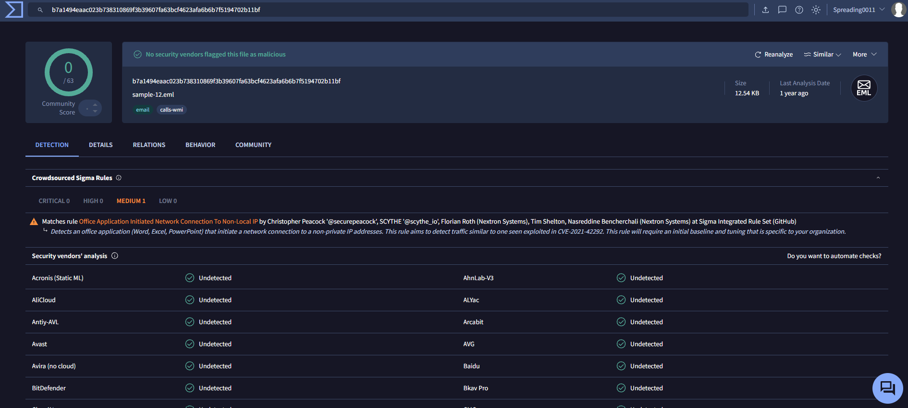

# Phishing Email Analysis — Binance Impersonation

## Overview

This SOC L1 case study examines `email-analysis.eml`, an email claiming to represent Binance and requesting immediate account verification.

The investigation covers sender information, recorded authentication results, message content, embedded URLs, and supporting reputation checks.

## Tools

| Tool | Purpose |
|---|---|
| VS Code | Inspect the original email as text |
| VirusTotal | Review existing URL, domain, and IP reputation reports |
| emlbuddy.app | Application designed to analyze .eml files directly in your browser. |

Website results are recorded separately from observations in the original email. Current reputation results may differ from conditions when this email was sent in 2022.

## 1. Preserve the Original Email

Kept the original `email-analysis.eml` unchanged and used a copy for investigation.

To calculate its SHA-256 hash on Windows, run:

```powershell
Get-FileHash .\email-analysis.eml -Algorithm SHA256
```

**SHA-256:** `B7A1494EAAC023B738310869F3B39607FA63BCF4623AFA6B6B7F5194702B11BF`


## 2. Review Sender and Basic Headers

Opened the email in VS Code and located the From, Reply-To, Return-Path, Subject, and Date headers.

| Field | Observed value |
|---|---|
| Display name | Binance |
| From | `do-not-reply@ses.binance.com` |
| Reply-To | `do-not-reply@ses.binance.com` |
| Return-Path | `wpcloud@ilonasavola.com` |
| Date | 22 August 2022, 21:39:41 UTC |
| Subject | Requests immediate verification and includes Binance-like branding |

### Assessment

The visible From address claims Binance, while the Return-Path uses an unrelated domain. This mismatch requires investigation but does not independently prove phishing.

The subject also contains visually similar characters in its branding. Preserve the exact subject when documenting this observation.


## 3. Review Email Authentication

Located the `Authentication-Results` and `Received-SPF` headers.

| Check | Recorded result | Interpretation |
|---|---|---|
| SPF | `none` | No applicable SPF authorisation was reported for the envelope sender |
| DKIM | `none` | No DKIM signature was reported |
| DMARC | `fail` | The receiving system reported that the visible From domain did not pass DMARC authentication |

### Assessment

The recorded results do not authenticate the message as an authorised Binance email. Combined with the sender mismatch and message content, they strengthen the phishing assessment.

These are results recorded in the supplied email, not authentication checks independently rerun during this investigation. Authentication failure alone is not sufficient for a phishing verdict.


## 4. Review the Delivery Route

I used EMLBuddy (https://emlbuddy.app/) to review the Received headers in `email-analysis.eml` and trace the recorded delivery route.

| Field | Recorded value |
|---|---|
| Connecting hostname | `smtp2.wp-cloud.fi` |
| Connecting IP | `84.34.166.151` |
| Envelope sender domain | `ilonasavola.com` |

### Assessment

The Received headers record a connection from `smtp2.wp-cloud.fi` (`84.34.166.151`) into Microsoft's receiving infrastructure. The Authentication-Results header also records this IP as the connecting sender.

This identifies the sending server observed by the receiving system. It does not establish the attacker's identity or independently prove that the server was malicious.


## 5. Analyse Message Content

I uploaded `email-analysis.eml` to EMLBuddy (https://emlbuddy.app/) and used its email preview to examine how the message appeared to the recipient.

I reviewed the branding, wording, requested action, and social engineering indicators.

| Indicator | Observation |
|---|---|
| Brand impersonation | Claims to represent Binance |
| Account problem | States that account information has expired |
| Financial pressure | Claims withdrawals are disabled |
| Urgency | Requests an update within 72 hours |
| Threat | Warns of permanent account disablement |
| Requested action | Encourages the recipient to select “UPDATE INFORMATIONS” |
| Language | Includes awkward wording such as “your information has been expired” |

### Assessment

The message uses Binance branding, financial concerns, and a deadline to pressure the recipient into following a verification link. Language errors provide supporting context but are not sufficient on their own to classify the email as phishing.

The email preview supports content inspection; it does not independently establish whether linked websites are malicious.


## 6. Extract and Inspect URLs

Reviewed the HTML link destinations and compared them with the message's claimed identity.

When examining raw quoted-printable HTML, decode it first: `=3D` represents an equals sign, and soft line breaks can split a URL.

| URL | Role |
|---|---|
| `https://zzdzw.com/` | Destination of the verification action |
| `https://public.bnbstatic.com/image/email_template/emailBanner.png` | Remote image used in the message |

### Assessment

The verification action points to `zzdzw.com`, rather than a Binance-branded destination. Combined with the recorded DMARC failure and account-disable pressure, this is a strong phishing indicator.

The image URL and verification URL serve different purposes. The presence of a branded image does not authenticate the email.


## 7. Check File and URL Reputation — VirusTotal

I checked the email’s SHA-256 hash and extracted verification URL using VirusTotal.

### URL Result

VirusTotal flagged `https://zzdzw.com/` as malicious.


### File Hash Result

The file report displayed a Sigma rule match:

**Office Application Initiated Network Connection To Non-Local IP**

This rule identifies Office applications connecting to public IP addresses. The match requires context and does not independently prove that this email executed malware or exploited CVE-2021-42292.



### Assessment

The URL verdict supports the phishing assessment. The Sigma match is supporting evidence requiring further investigation.


## 8. Record Investigation Indicators

These indicators are extracted evidence, not independently confirmed malicious infrastructure.

| Type | Indicator | Context |
|---|---|---|
| Claimed From | `do-not-reply@ses.binance.com` | Identity presented to the recipient |
| Return-Path | `wpcloud@ilonasavola.com` | Envelope sender |
| Connecting IP | `84.34.166.151` | Recorded external delivery connection |
| Connecting hostname | `smtp2.wp-cloud.fi` | Recorded sending server |
| Verification URL | `https://zzdzw.com/` | Destination of the requested action |

The claimed Binance address should not be treated as malicious infrastructure merely because it appears in a suspicious email.

## 9. SOC L2 Escalation

**Title:** Binance impersonation email requesting account verification

**Reason for escalation:** Combined impersonation, recorded authentication failure, unrelated verification destination, and account-disable pressure.

**Evidence provided:** Original email hash, header observations, extracted indicators, screenshots, and completed reputation-check results.
