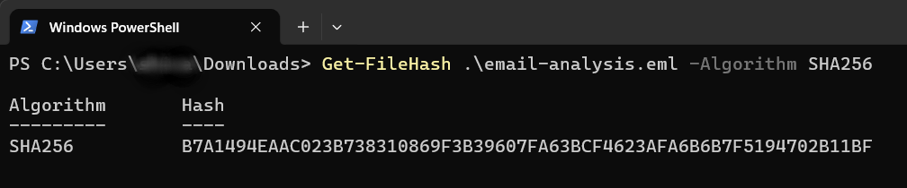
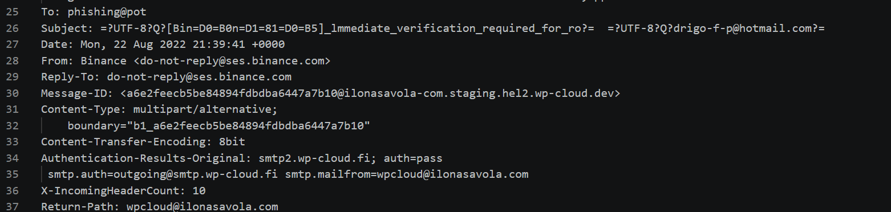
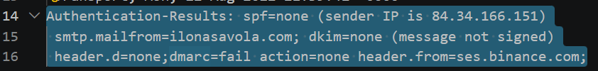
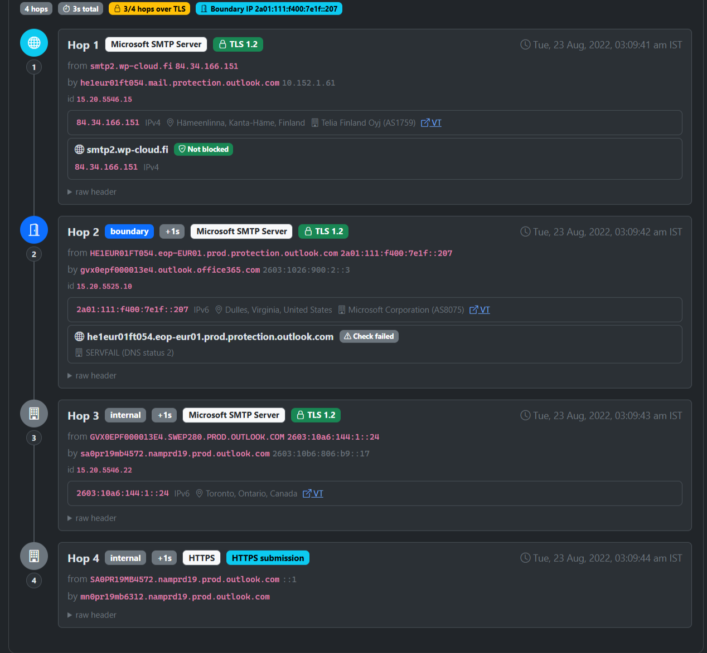
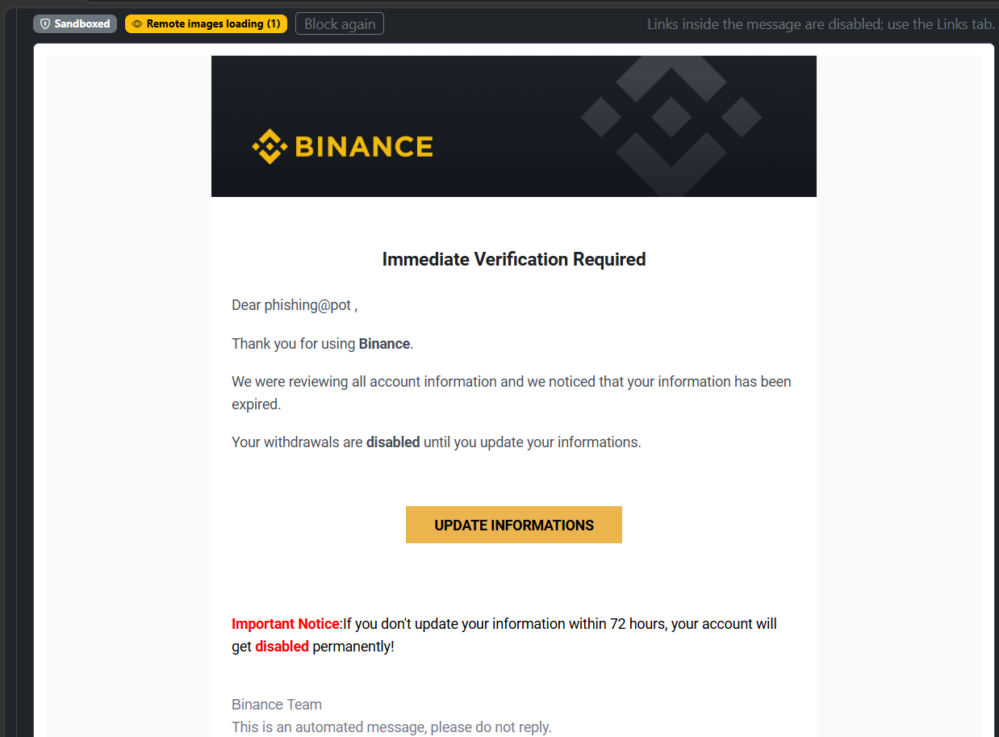
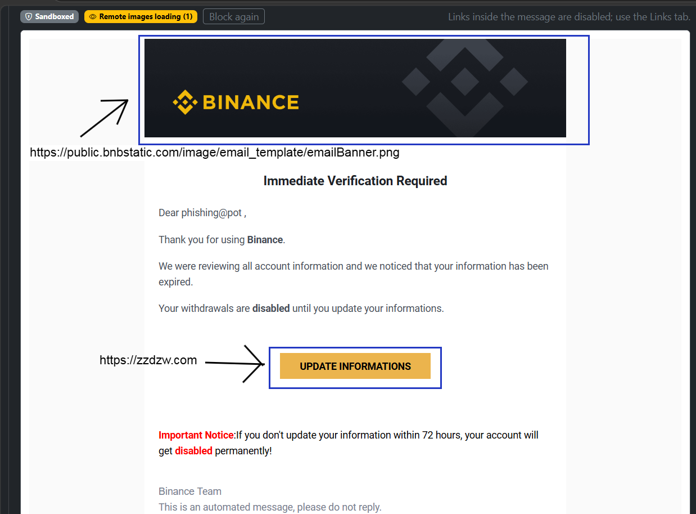
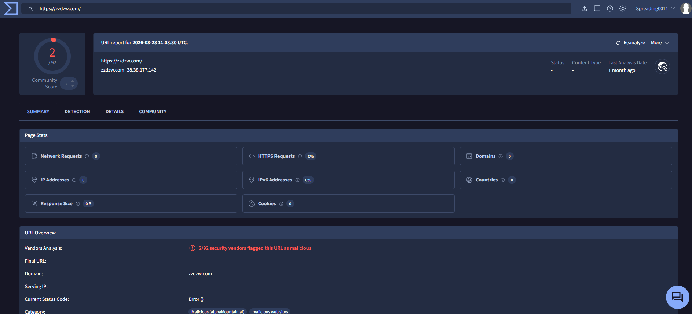

# Phishing Email Analysis — Binance Impersonation

## Overview

This SOC L1 case study examines `email-analysis.eml`, an email claiming to represent Binance and requesting immediate account verification.

The investigation covers sender information, recorded authentication results, message content, embedded URLs, and supporting reputation checks.

## Tools

| Tool | Purpose |
|---|---|
| VS Code | Inspect the original email as text |
| CyberChef | Decode quoted-printable or Base64 content where needed |
| VirusTotal | Review existing URL, domain, and IP reputation reports |
| URLScan.io | Search for existing scans and examine recorded website behaviour |

Website results are recorded separately from observations in the original email. Current reputation results may differ from conditions when this email was sent in 2022.

## 1. Preserve the Original Email

Kept the original `email-analysis.eml` unchanged and used a copy for investigation.

To calculate its SHA-256 hash on Windows, run:

```powershell
Get-FileHash .\email-analysis.eml -Algorithm SHA256
```

**SHA-256:** `[Add the calculated hash]`



## 2. Review Sender and Basic Headers

Opened the email in VS Code and located the From, Reply-To, Return-Path, Subject, and Date headers.

| Field | Observed value |
|---|---|
| Display name | Binance |
| From | `do-not-reply@ses.binance[.]com` |
| Reply-To | `do-not-reply@ses.binance[.]com` |
| Return-Path | `wpcloud@ilonasavola[.]com` |
| Date | 22 August 2022, 21:39:41 UTC |
| Subject | Requests immediate verification and includes Binance-like branding |

### Assessment

The visible From address claims Binance, while the Return-Path uses an unrelated domain. This mismatch requires investigation but does not independently prove phishing.

The subject also contains visually similar characters in its branding. Preserve the exact subject when documenting this observation.



## 3. Review Email Authentication

Located the `Authentication-Results` and `Received-SPF` headers.

| Check | Recorded result | Interpretation |
|---|---|---|
| SPF | `none` | No applicable SPF authorisation was reported for the envelope sender |
| DKIM | `none` | No DKIM signature was reported |
| DMARC | `fail` | The receiving system reported that the visible From domain did not pass DMARC authentication |

### Assessment

The recorded results do not authenticate the message as an authorised Binance email. Combined with the sender mismatch and message content, they strengthen the phishing assessment.

These are results recorded in the supplied email, not authentication checks independently rerun during this investigation. Authentication failure alone is not sufficient for a phishing verdict.



## 4. Review the Delivery Route

Reviewed the Received headers, following the route from the earlier entries toward the receiving system.

The external connection into the Microsoft receiving infrastructure is recorded as:

| Field | Recorded value |
|---|---|
| Connecting hostname | `smtp2.wp-cloud[.]fi` |
| Connecting IP | `84.34.166.151` |
| Envelope sender domain | `ilonasavola[.]com` |

### Assessment

The receiving header and authentication results both identify `84.34.166.151` as the connecting IP.

This identifies the server recorded as delivering the message to the receiving infrastructure. It does not identify the attacker or prove that the server itself was malicious.



## 5. Analyse Message Content

Reviewed the text/plain body and decoded HTML content without following the links.

If content is encoded, use CyberChef:

- For quoted-printable content, use the **From Quoted Printable** operation.
- For Base64 content, use the **From Base64** operation.
- Decode only the relevant MIME body section, rather than the entire email.

| Indicator | Observation |
|---|---|
| Brand impersonation | Claims to represent Binance |
| Account problem | States that account information has expired |
| Financial pressure | Claims withdrawals are disabled |
| Urgency | Requests an update within 72 hours |
| Threat | Warns of permanent account disablement |
| Requested action | Encourages the recipient to select “UPDATE INFORMATIONS” |
| Language | Includes awkward wording such as “your information has been expired” |

### Assessment

The message combines a familiar brand, financial concern, and a deadline to persuade the recipient to follow a verification link. Language errors provide supporting context but are not decisive evidence on their own.



## 6. Extract and Inspect URLs

Reviewed the HTML link destinations and compared them with the message's claimed identity.

When examining raw quoted-printable HTML, decode it first: `=3D` represents an equals sign, and soft line breaks can split a URL.

| URL | Role |
|---|---|
| `hxxps://zzdzw[.]com/` | Destination of the verification action |
| `hxxps://public[.]bnbstatic[.]com/image/email_template/emailBanner.png` | Remote image used in the message |

### Assessment

The verification action points to `zzdzw[.]com`, rather than a Binance-branded destination. Combined with the recorded DMARC failure and account-disable pressure, this is a strong phishing indicator.

The image URL and verification URL serve different purposes. The presence of a branded image does not authenticate the email.



## 7. Check URL Reputation — VirusTotal

### Procedure

1. Open `https://www.virustotal.com`.
2. Search for the extracted verification URL or domain.
3. Review any existing report.
4. Record the analysis timestamp and vendor detection results.
5. Distinguish “no existing report” from a clean verdict.

Start with existing reports. Submitting a new URL can cause the service to visit it, and submission visibility should be considered.

### Results

| Field | Investigation result |
|---|---|
| Indicator checked | `zzdzw[.]com` / extracted verification URL |
| Check date | `[Add date]` |
| Report analysis date | `[Add date shown by the service]` |
| Detection result | `[Add actual detection count or verdict]` |
| Report reference | `[Add report link, if available]` |

### Interpretation

`[Explain what the actual report supports. Do not label the URL malicious solely because the email is suspicious.]`



## 8. Review Website Evidence — URLScan.io

### Procedure

1. Open `https://urlscan.io`.
2. Search existing scans using:

```text
domain:zzdzw.com
```

3. Check whether the scan matches the email's destination and relevant path.
4. Review the scan date, final URL, redirects, page screenshot, and verdict.
5. If no scan exists, record that result.

A historical scan shows what was observed at its scan time. It does not automatically establish what the email's destination displayed in 2022.

### Results

| Field | Investigation result |
|---|---|
| Scan date | `[Add date]` |
| Final destination | `[Add if available]` |
| Redirects | `[Add if observed]` |
| Page content | `[Describe what the scan actually shows]` |
| Scan verdict | `[Add recorded verdict]` |
| Report reference | `[Add report link]` |

### Interpretation

`[State whether the scan supports impersonation or credential collection. If the page is unavailable, document that limitation.]`


## 9. Optional Connecting-IP Reputation Check

Search `84.34.166.151` in VirusTotal and review any existing IP report.

| Field | Investigation result |
|---|---|
| IP checked | `84.34.166.151` |
| Check date | `[Add date]` |
| Reported result | `[Add actual result]` |

An IP reputation result is supporting context. Shared infrastructure and changes in ownership mean it should not independently determine the email verdict.


## 10. Check for Attachments

Reviewed the MIME structure of the supplied email.

**Finding:** No embedded attachments were identified. The message contains plain-text and HTML bodies and uses an external verification link.

Attachment malware analysis is therefore outside the scope of this sample.

## 11. Record Investigation Indicators

These indicators are extracted evidence, not independently confirmed malicious infrastructure.

| Type | Indicator | Context |
|---|---|---|
| Claimed From | `do-not-reply@ses.binance[.]com` | Identity presented to the recipient |
| Return-Path | `wpcloud@ilonasavola[.]com` | Envelope sender |
| Connecting IP | `84.34.166.151` | Recorded external delivery connection |
| Connecting hostname | `smtp2.wp-cloud[.]fi` | Recorded sending server |
| Verification URL | `hxxps://zzdzw[.]com/` | Destination of the requested action |

The claimed Binance address should not be treated as malicious infrastructure merely because it appears in a suspicious email.

## 12. Final Assessment

**Email verdict:** Phishing, based on the combined message and header evidence.

### Supporting Evidence

- Claims to represent Binance.
- Uses an unrelated envelope sender.
- Recorded authentication results show SPF none, DKIM none, and DMARC fail.
- Directs verification to an unrelated domain.
- Uses withdrawal restrictions and a 72-hour deadline to encourage action.

**Credential-harvesting assessment:** Suspected purpose. A credential-collection form has not been established unless supported by website-analysis evidence.

**Impact:** No evidence of recipient clicks, submitted credentials, or account compromise was available.

### External-Tool Findings

`[Summarise completed VirusTotal and URLScan.io checks here. Remove this section if those checks were not performed.]`

## 13. Simulated SOC L1 Escalation

**Title:** Binance impersonation email requesting account verification

**Reason for escalation:** Combined impersonation, recorded authentication failure, unrelated verification destination, and account-disable pressure.

**Evidence provided:** Original email hash, header observations, extracted indicators, screenshots, and completed reputation-check results.

### Recommended L2 Follow-up

- Search mail logs for related messages and affected recipients.
- Review proxy or DNS logs for visits to the extracted destination.
- Determine whether any recipient submitted credentials.
- Assess message removal and URL blocking under the response playbook.
- If account exposure is confirmed, coordinate session revocation and credential reset.

**Actions completed in this lab:** Email review and investigation documentation.


## Screenshot Checklist

- [ ] `Images/eml12-file-hash.png`
- [ ] `Images/eml12-basic-headers.png`
- [ ] `Images/eml12-authentication.png`
- [ ] `Images/eml12-delivery-route.png`
- [ ] `Images/eml12-message-content.png`
- [ ] `Images/eml12-extracted-links.png`
- [ ] `Images/eml12-virustotal-url.png` — if performed
- [ ] `Images/eml12-urlscan.png` — if performed
- [ ] `Images/eml12-ip-reputation.png` — optional

Keep the `Images` folder beside this Markdown file. Redact personal recipient information from public screenshots. Replace placeholders and remove unused image references before publishing.
