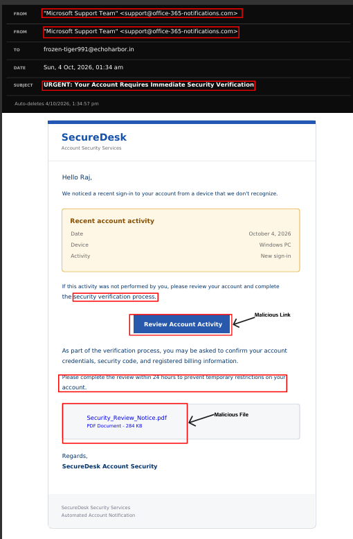

# Phishing Campaign Analysis

**Controlled simulation · CanIPhish · FreeCustom.Email · Manual email review**

## Overview

I used CanIPhish to run a phishing campaign simulation and FreeCustom.Email as a temporary mailbox to receive and review the messages. The scenario used an account-security notification to encourage the recipient to review an unfamiliar sign-in and complete a verification process.

My investigation focused on how the email appeared to the recipient, the social engineering techniques it used, and the sender details and links available in the message. I preserved a screenshot and mailbox export as supporting evidence.

## Tools and Evidence

| Tool or evidence | Purpose |
|---|---|
| CanIPhish | Create and send the phishing simulation |
| FreeCustom.Email | Receive and inspect the simulation messages in a temporary mailbox |
| Manual review | Examine the sender, subject, branding, requested actions, and visible links |
| Email screenshot | Preserve the recipient's view of the message |
| `.mbox` export | Preserve the two received message samples for comparison and further analysis |

## Investigation Workflow

### 1. Prepare the Temporary Mailbox

I created a temporary mailbox using FreeCustom.Email and used it as the recipient for the CanIPhish simulation.

### 2. Run the Simulation

I used CanIPhish to send an account-security verification message. The email claimed that a sign-in had occurred from an unfamiliar device and asked the recipient to review the activity.

### 3. Inspect the Received Email

I reviewed the email in the temporary mailbox, checking:

- The displayed sender name and email address.
- The subject line and account-security claim.
- Branding in the body and signature.
- The deadline and warning of account restrictions.
- The information requested during verification.
- The account-review button and document link.

### 4. Identify and Document Phishing Indicators

| Area reviewed | Observation | Investigation significance |
|---|---|---|
| Sender identity | Display name claimed to be Microsoft Support Team | Uses a familiar support identity to establish trust |
| Sender address | `support@office-365-notifications[.]com` | The address should be validated independently rather than trusted from its wording |
| Body branding | SecureDesk Account Security | Branding differs from the claimed Microsoft support identity |
| Subject | URGENT: Your Account Requires Immediate Security Verification | Encourages immediate attention |
| Security pretext | Reports an unfamiliar sign-in | Uses concern about account access to motivate interaction |
| Deadline | Requests completion within 24 hours | Creates time pressure |
| Consequence | Warns of temporary account restrictions | Increases pressure to comply |
| Requested information | Mentions credentials, a security code, and billing information | Consistent with a lure seeking sensitive information |
| Document presentation | Shows `Security_Review_Notice.pdf` in an attachment-style box | Makes an external document link appear like an attached notice |

### 5. Review the Link Evidence

The account-review destination in the supplied message content is:

`hxxps://securedesk[.]example[.]test/account-review`

The `.test` hostname is consistent with this training scenario. The PDF-styled item links to a Google Drive file; it is not an embedded PDF attachment in the mailbox export.

The supplied HTML also contains a hidden tracking image with a CanIPhish marker. Its presence is consistent with simulation tracking, but does not independently confirm an email open, link click, or credential submission.

No live landing-page inspection, document-content analysis, or external reputation verdict is claimed in this report. URLs are defanged, and full tracking identifiers are omitted from the public documentation.

### 7. Preserve the Evidence

I captured the rendered email and exported the mailbox to retain the message content for documentation and later analysis.

The screenshot below shows the sender details, urgency, account-review button, sensitive-information request, and PDF-styled link.

## Header Review Scope

The temporary mailbox did not display full transport and authentication headers. The supplied export contains basic message fields, including From, To, Subject, Date, and Message-ID.

SPF, DKIM, DMARC, the originating IP, and the delivery route could not be assessed from the available evidence. This case study therefore focuses on the message content, available sender details, social engineering, and link presentation. Full-header analysis can be documented separately when suitable evidence is available.

## Assessment

The simulation demonstrates an account-verification phishing lure combining a trusted support identity, inconsistent branding, urgency, account-restriction pressure, and a request for sensitive information.

The document-style link and account-review button provide clear examples of how a message can encourage interaction. No actual credential theft, malicious document, or account compromise was established in this exercise.

## Recommended SOC Follow-up

If a similar message were reported in a production environment, recommended follow-up would include:

- Preserve the original email and obtain full headers.
- Validate sender authentication and inspect linked destinations using approved analysis tools.
- Search for related messages to establish the scope.
- Determine whether recipients clicked links, downloaded files, or submitted information.
- Escalate confirmed exposure according to the organisation's response procedures.

## Skills Practised

- Controlled phishing simulation setup
- Manual email and sender-detail review
- Social engineering assessment
- Link and attachment-presentation interpretation
- Comparison of related message samples
- Evidence preservation and investigation documentation

## Conclusion

This exercise connected phishing simulation with recipient-side analysis. I documented the indicators visible in the received messages, preserved supporting evidence, and distinguished observed findings from checks requiring additional data.
